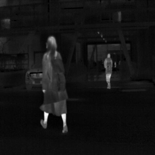

# 🧠 NeurIPS 2024 Reproducibility: Text-DiFuse

This repository documents our successful hands-on reproducibility session for the NeurIPS 2024 paper:

> **Title:** Text-DiFuse: An Interactive Multi-Modal Image Fusion Framework  
> **Paper Link:** [Text-DiFuse (NeurIPS 2024)](https://proceedings.neurips.cc/paper_files/paper/2024/hash/45e409b46bebd648e9041a628a1a9964-Abstract-Conference.html)  
> **GitHub Repo:** [https://github.com/Leiii-Cao/Text-DiFuse](https://github.com/Leiii-Cao/Text-DiFuse)

---

## ✅ What We Reproduced

We reproduced a **key visual result** from the Text-DiFuse paper using the official code and pretrained models. Specifically, we ran the **VIS-IR (Visible + Infrared) image fusion task**, which merges visual and thermal features into a single high-quality output.

---

## 📸 Example Result

| Visible Image Input                 | Infrared Image Input                 | Fused Output (Text-DiFuse)         |
| ----------------------------------- | ------------------------------------ | ---------------------------------- |
|  |  |  |

> _Note: Replace the `images/*.png` paths with your actual image files._

---

## 🧪 Reproduction Steps

1. **Cloned the official repo:** [Text-DiFuse](https://github.com/Leiii-Cao/Text-DiFuse)
2. **Set up the environment** in Google Colab (Torch, OpenCV, NumPy 1.24.4).
3. **Downloaded pretrained model weights** and sample image data from the authors’ Drive.
4. **Modified the test loop** to process only one image pair to avoid GPU memory issues.
5. Ran the pipeline and saved the output in the `result/VIS-IR/` folder.

---

## ⚙️ Technical Challenges & Fixes

- 🧩 **NumPy 2.x issue:** Downgraded to `numpy==1.24.4` to avoid `_ARRAY_API not found` errors.
- 🔄 **Model loading mismatch:** Used `map_location="cuda:0"` and `strict=False` to fix checkpoint errors.
- 🚫 **Out of memory (OOM):** Limited image processing to a single image pair, reduced resolution, and cleared CUDA cache.

---

## 🎯 Relevance to Our Project

Our project, **AI Multi-Modal Marketing Content Generator**, also involves:

- Multi-modal data (image + text).
- Image transformation and enhancement via AI.
- Real-time user-guided generation.

Text-DiFuse’s interactive, text-guided image fusion methodology provides technical insight into how multimodal signals can be fused meaningfully — especially useful for visual storytelling or context-aware marketing visuals.

---

## 🧾 License & Acknowledgements

All code and model weights are from the official [Text-DiFuse repository](https://github.com/Leiii-Cao/Text-DiFuse), licensed under the original authors’ terms.

---
